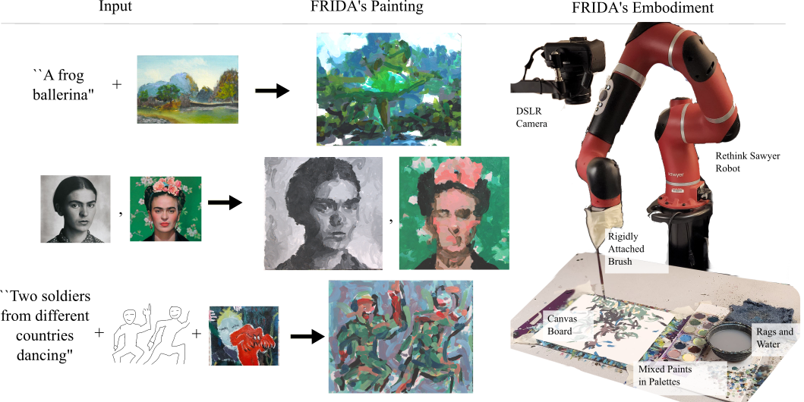

# FRIDA: A Collaborative Robot Painter with a Differentiable, Real2Sim2Real Simulated Planning Environment  <a href="https://twitter.com/FridaRobot" target="_blank"></a> <a href="https://colab.research.google.com/drive/1xM8v1d5I02CeAQ_rd1-vQH3jhG_X1TqB?usp=sharing" target="_blank"></a> <a href="https://arxiv.org/abs/2210.00664" target="_blank"></a>

[Peter Schaldenbrand](https://pschaldenbrand.github.io/#about.html), [Jean Oh](https://www.cs.cmu.edu/~./jeanoh/), [Jim McCann](http://www.cs.cmu.edu/~jmccann/)

The Robotics Institute, Carnegie Mellon University

FRIDA (a Framework and Robotics
Initiative for Developing Arts) enables humans to
produce paintings on canvases by collaborating with a painter
robot using simple inputs such as language descriptions or
images. FRIDA creates a fully differentiable simulation environment for
painting using real data, adopting the idea of real to simulation to real
(real2sim2real) in which it can plan and dynamically respond to stochasticity in the
execution of that plan.
<a href="https://twitter.com/FridaRobot" target="_blank">
    
    Follow FRIDA's Paintings on Twitter!
</a>
<a href="https://colab.research.google.com/drive/1xM8v1d5I02CeAQ_rd1-vQH3jhG_X1TqB?usp=sharing" target="_blank">
    
    Try our Colab Demo
</a>
<a href="https://arxiv.org/abs/2210.00664" target="_blank">
    
    Read our paper on ArXiv
</a>



# Installation

```
git clone https://github.com/pschaldenbrand/Frida.git

# Frida's robot code is in python2.7 and planning code is in python 3.6
pip install --r [requirements.txt|requirements_windows.txt]
pip3 install --r requirements_python3.txt

# Camera installation
sudo apt install gphoto2 libgphoto2*
```

# Run in Simulation

```
cd src/
python3 plan.py --simulate [other args see below]
```

# Monitoring Painting Progress

We use tensorboard to monitor the progress of the painting.

```
# In another terminal, run this to view progress
tensorboard --logdir Frida/src/painting

# Open browser and navigate to http://localhost:6006/
```

# Arguments

```
python3 plan.py // If running in simulation/Colab
rosrun paint paint.py // If running with a robot
    [--simulate] Run in only simulation
    [--use_cache] Use cached calibration files. Necessary if --simulation
    [--cache_dir path] Where the cached calibration files are stored if using them
    [--max_height int] Height of the sim. canvases. Decrease for CUDA memory errors. Default 256
    [--num_papers int] Number of full sheets of paper to fill with training brush strokes (30 per paper)
    [--n_colors int] Number of discrete paint colors to use
    [--use_colors_from path] If specified, use K-means to get paint colors from this image. Default None
    [--num_strokes int] The desired number of strokes in the painting
    [--n_stroke_models int] Number of different trained param2stroke models to use and randomly sample from
    [--adaptive] Use the perception for replanning
    [--strokes_before_adapting int] # strokes to perform before replanning
    [--remove_prop float] proportion of strokes exectued from plan to remove when replanning
    [--adapt_optim_iter int] Number of optimization iterations when replanning
    [--objective [one or many text|clip_conv_los|l2|sketch|style]]
    [--objective_data]
    [--objective_weight]
    [--n_inits int] Number of intermediate optimizations to try then choose the best based on loss
    [--intermediate_optim_iter int] Number of optimization iterations for intermediate optimization
    [--num_augs int] Number of augmentations when using CLIP
    [--bin_size int] Sort strokes in bin sizes by color before executing
    [--lr_multiplier float] How much to scale the learning rates for the brush stroke parameter optimization algorithm
```

# Objectives

Frida can paint with a number of different objectives that can be used singularly or in weighted combination. They are used to compare the simulated painting plan and a target datum (image or text):
- `l2` - Simple Euclidean distance is computed between the painting and target image
- `clip_conv_loss` - Compare the CLIP Convolutional features extracted from the painting and target image
- `clip_fc_loss` - Compare the CLIP embeddings of the painting and target image
- `text` - Compare the CLIP embeddings of the paiting and the input text description
- `style` - Compares style features from the painting and the target image
- `sketch` - [Use `clip_conv_loss` instead right now] Converts the painting and target sketch into sketches then compares them

Each objective specified must have a specified data file and weight given to it. Objectives can be specified for the initial optimization pass and for the full, final optimization. Here is an example of how to specify objectives where we have an initial objetive to make the painting look like `style_img.jpg` and then a final objective to have the style of `style_img.jpg` with the text description `"a frog ballerina"`:
```
cd Frida/src
python3 plan.py --simulate --use_cache --cache_dir cache/
   --init_objective l2 
   --init_objective_data path/to/style_img.jpg
   --init_objective_weight 1.0
   --objective style text
   --objective_data path/to/style_img.jpg  "a frog ballerina"
   --objective_weight 0.2  1.0
```

# Run with a robot

See the `ROS` directory for necessary files for running a robot with ROS. We have only tested FRIDA's code with a Rethink Sawyer robot.  Some work will be needed to use this codebase with a new machine. See `src/robot.py` to see how things were done with the Sawyer and adapt the code for a new machine.  We would be happy to help with this if you're interested in using this code with your machine. Please email Peter at pschalde at andrew dot cmu dot edu
```
rosrun paint paint.py [args]
```

## Acknowledgements

Thank you to: 
- [Jia Chen Xu](https://github.com/jxu12345) for writing FRIDA's perception code
- Heera Sekhr and Jesse Ding for their help in the early stages of designing FRIDA's planning algorithms
- [Vihaan Misra](https://github.com/convexalpha) for writing a sketch loss function.
- Tanmay Shankar for his help with initial installation and fixing the Sawyer robot
