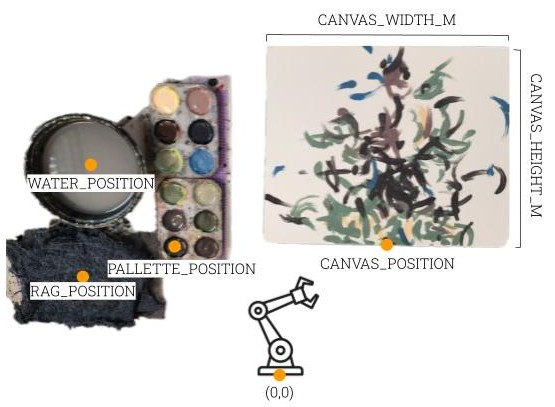

# FRIDA: A Collaborative Robot Painter with a Differentiable, Real2Sim2Real Simulated Planning Environment  <a href="https://twitter.com/FridaRobot" target="_blank"></a> <a href="https://colab.research.google.com/github/pschaldenbrand/Frida/blob/master/Frida.ipynb" target="_blank"></a> <a href="https://arxiv.org/abs/2210.00664" target="_blank"></a><a href="https://www.tiktok.com/@frida_robot?lang=en" target="_blank"></a>

[Peter Schaldenbrand](https://pschaldenbrand.github.io/#about.html), [Jean Oh](https://www.cs.cmu.edu/~./jeanoh/), [Jim McCann](http://www.cs.cmu.edu/~jmccann/)

The Robotics Institute, Carnegie Mellon University

FRIDA (a Framework and Robotics
Initiative for Developing Arts) enables humans to
produce paintings on canvases by collaborating with a painter
robot using simple inputs such as language descriptions or
images. FRIDA creates a fully differentiable simulation environment for
painting using real data, adopting the idea of real to simulation to real
(real2sim2real) in which it can plan and dynamically respond to stochasticity in the
execution of that plan.
<a href="https://twitter.com/FridaRobot" target="_blank">
    
    Follow FRIDA's Paintings on X/Twitter!
</a>
<a href="https://colab.research.google.com/github/pschaldenbrand/Frida/blob/master/Frida.ipynb" target="_blank">
    
    Try our Colab Demo
</a>
<a href="https://arxiv.org/abs/2210.00664" target="_blank">
    
    Read our paper on ArXiv
</a>


# Installation

### System Requirements

We recommend running FRIDA on a machine with Python 3.8 and Ubuntu (we use 20.04). FRIDA's core functionality uses CUDA, so it is recommended to have an NVIDIA GPU with 8+Gb vRAM. Because CoFRIDA uses Stable Diffusion, it is recommended to have 12+Gb for running and 16+Gb vRam for training CoFRIDA.

### Code Installation

```
git clone https://github.com/pschaldenbrand/Frida.git

# Install CUDA

# We use Python 3.8

# Install python packages with PIP
cd Frida
pip3 install --r requirements.txt

# (OR) Install python packages with Conda
cd Frida
conda env create -n frida --file environment.yml
# Beware, you may need to re-install torch/torchvision depending on your cuda version.
# The following lines worked on our CUDA 12.2 system
pip uninstall torch torchvision
pip3 install torch torchvision torchaudio --index-url https://download.pytorch.org/whl/cu118

# Camera installation
sudo apt install gphoto2 libgphoto2*

# (optional) For training CoFRIDA, you'll need additional installation steps
cd Frida/src
pip3 install git+https://github.com/facebookresearch/segment-anything.git
wget https://dl.fbaipublicfiles.com/segment_anything/sam_vit_b_01ec64.pth
git clone https://github.com/jmhessel/clipscore.git
```

### Run with a robot

We currently support UFactory XArm and Franka Emika robots. To use a Rethink Sawyer robot, please install the "ICRA 2023" tag version of the github repository.

# Physical Setup `--materials_json`

Below you can see a depiction of FRIDA's materials. The locations of these items are specified in meters from the robot base. They are specified in `--materials_json` command line argument. See `Frida/materials.json` for an example.



# Equipment

Here is a list of the equipment that we use and some links to purchase. Each item may be able to be swapped out with small changes to the code.

- [Palettes for paint](https://www.amazon.com/gp/product/B07DKWTXWT/ref=ppx_yo_dt_b_search_asin_title?ie=UTF8&psc=1)
- [8x10 inch canvas boards](https://www.amazon.com/gp/product/B07RNK7DJ7/ref=ppx_yo_dt_b_search_asin_title?ie=UTF8&psc=1)
- [11x14 inch canvas boards](https://www.amazon.com/gp/product/B087F4F5DK/ref=ppx_yo_dt_b_search_asin_title?ie=UTF8&psc=1)
- [Canon EOS Rebel T7i (With 18-55mm Lens and With Web Streaming Kit)](https://www.bhphotovideo.com/c/product/1714575-REG/canon_canon_eos_rebel_t7.html)

# Monitoring Painting Progress

We use tensorboard to monitor the progress of the painting.

```
# In another terminal, run this to view progress
tensorboard --logdir Frida/src/painting_log

# Open browser and navigate to http://localhost:6006/
```

# Arguments

```
python3 paint.py 
    [--simulate] Run in only simulation
    [--robot] Which robot to use [franka|xarm]
    [--xarm_ip] If using xarm, specify its IP address
    [--materials_json path] Where JSON file specifying location of painting materials is
    [--use_cache] Use cached calibration files. Necessary if --simulation
    [--cache_dir path] Where the cached calibration files are stored if using them
    [--ink] If using a marker or brush pen, use this so the robot knows it doesn't need paint
    [--render_height int] Height of the sim. canvases. Decrease for CUDA memory errors. Default 256
    [--num_papers int] Number of full sheets of paper to fill with training brush strokes (30 per paper)
    [--n_colors int] Number of discrete paint colors to use
    [--use_colors_from path] If specified, use K-means to get paint colors from this image. Default None
    [--num_strokes int] The desired number of strokes in the painting
    [--objective [one or many text|clip_conv_los|l2|sketch|style]]
    [--objective_data] See below
    [--objective_weight] See below
    [--num_augs int] Number of augmentations when using CLIP
    [--lr_multiplier float] How much to scale the learning rates for the brush stroke parameter optimization algorithm
    [--num_adaptations int] Number of times to pause robot execution to take a photo and replan
    [--init_optim_iter int] Optimization iterations for initial plan
    [--optim_iter int] Optimization iterations for each time FRIDA replans
```

# Objectives

Frida can paint with a number of different objectives that can be used singularly or in weighted combination. They are used to compare the simulated painting plan and a target datum (image or text):
- `l2` - Simple Euclidean distance is computed between the painting and target image
- `clip_conv_loss` - Compare the CLIP Convolutional features extracted from the painting and target image
- `clip_fc_loss` - Compare the CLIP embeddings of the painting and target image
- `text` - Compare the CLIP embeddings of the paiting and the input text description
- `style` - Compares style features from the painting and the target image
- `sketch` - [Use `clip_conv_loss` instead right now] Converts the painting and target sketch into sketches then compares them
- `emotion` - Guide the painting towards the following emotions: amusement, awe, contentment, excitement, anger, disgust, fear, sadness, something else. Specified in comma-sparated list of weights. e.g., half anger and fear: `--objective_data 0,0,0,0,.5,0,.5,0,0`

Each objective specified must have a specified data file and weight given to it. Objectives can be specified for the initial optimization pass and for the full, final optimization. Here is an example of how to specify objectives where we have an initial objetive to make the painting look like `style_img.jpg` and then a final objective to have the style of `style_img.jpg` with the text description `"a frog ballerina"`:
```
cd Frida/src
python3 paint.py --simulate --use_cache --cache_dir caches/sharpie_short_strokes
   --objective style text
   --objective_data path/to/style_img.jpg  "a frog ballerina"
   --objective_weight 0.2  1.0
```


## Acknowledgements

Thank you to: 
- [Jia Chen Xu](https://github.com/jxu12345) for writing FRIDA's perception code
- Heera Sekhr and Jesse Ding for their help in the early stages of designing FRIDA's planning algorithms
- [Vihaan Misra](https://github.com/convexalpha) for writing a sketch and audio loss functions.
- Tanmay Shankar for his help with initial installation and fixing the Sawyer robot
- Kevin Zhang for his incredible help with installation with Franka robot
