# FRIDA <a href="https://twitter.com/FridaRobot" target="_blank"></a>   <a href="https://www.tiktok.com/@frida_robot?lang=en" target="_blank"> </a>

FRIDA (A Framework and Robotics Initiative for Developing Arts), is a robotic painting project developed at
The Robotics Institute, Carnegie Mellon University.
This repository contains the code for two ICRA papers described below.

Maintained by Peter Schaldenbrand


# [CoFRIDA: Self-Supervised Fine-Tuning for Human-Robot Co-Painting](https://pschaldenbrand.github.io/cofrida/)
<b>Best Paper on Human-Robot Interaction, ICRA 2024</b>

[Peter Schaldenbrand](https://pschaldenbrand.github.io/#about.html), [Gaurav Parmar](https://gauravparmar.com/), [Jun-Yan Zhu](https://www.cs.cmu.edu/~junyanz/), [Jim McCann](http://www.cs.cmu.edu/~jmccann/), and [Jean Oh](https://www.cs.cmu.edu/~./jeanoh/)

A collaborative robotic painting assistant. Code for this paper is in the [frida/cofrida directory](https://github.com/cmubig/Frida/tree/master/cofrida).

https://github.com/cmubig/Frida/assets/14282484/693cd7c1-68da-4847-8f68-95364acf14ee


# FRIDA: A Collaborative Robot Painter with a Differentiable, Real2Sim2Real Simulated Planning Environment <a href="https://colab.research.google.com/github/pschaldenbrand/Frida/blob/master/Frida.ipynb" target="_blank"></a> <a href="https://arxiv.org/abs/2210.00664" target="_blank"></a>

<b>Finalist for Best Paper in Deployed Systems, ICRA 2023</b>

[Peter Schaldenbrand](https://pschaldenbrand.github.io/#about.html), [Jean Oh](https://www.cs.cmu.edu/~./jeanoh/), [Jim McCann](http://www.cs.cmu.edu/~jmccann/)

The Robotics Institute, Carnegie Mellon University

FRIDA (a Framework and Robotics
Initiative for Developing Arts) enables humans to
produce paintings on canvases by collaborating with a painter
robot using simple inputs such as language descriptions or
images. FRIDA creates a fully differentiable simulation environment for
painting using real data, adopting the idea of real to simulation to real
(real2sim2real) in which it can plan and dynamically respond to stochasticity in the
execution of that plan.
<a href="https://twitter.com/FridaRobot" target="_blank">
    
    Follow FRIDA's Paintings on X/Twitter!
</a>
<a href="https://colab.research.google.com/github/pschaldenbrand/Frida/blob/master/Frida.ipynb" target="_blank">
    
    Try our Colab Demo
</a>
<a href="https://arxiv.org/abs/2210.00664" target="_blank">
    
    Read our paper on ArXiv
</a>

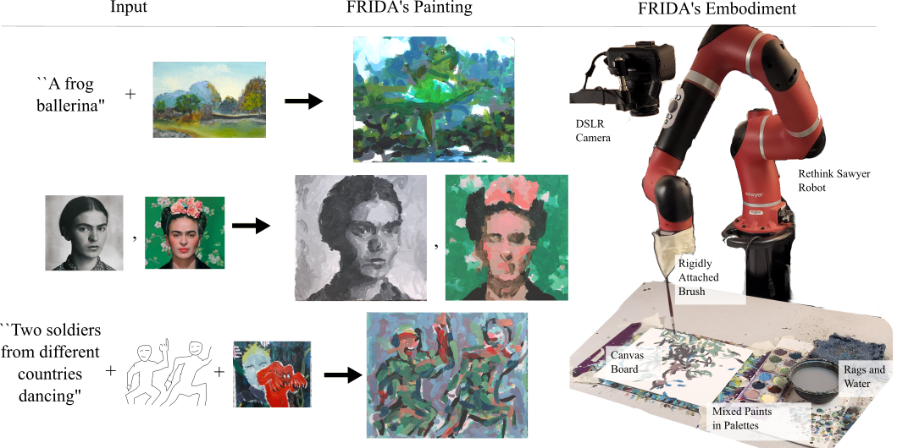

# Installation

### System Requirements

We recommend running FRIDA on a machine with Python 3.8 and Ubuntu (we use 20.04). FRIDA's core functionality uses CUDA, so it is recommended to have an NVIDIA GPU with 8+Gb vRAM. Because CoFRIDA uses Stable Diffusion, it is recommended to have 12+Gb for running and 16+Gb vRam for training CoFRIDA.

### Code Installation

```
git clone https://github.com/pschaldenbrand/Frida.git

# Install CUDA

# We use Python 3.8

# Install python packages with PIP
cd Frida
pip3 install --r requirements.txt

# (OR) Install python packages with Conda
cd Frida
conda env create -n frida --file environment.yml
conda activate frida

# (OR) Install environment via [UV](https://docs.astral.sh/uv/getting-started/installation/) here `python3.11`is being used
cd Frida
uv venv
uv sync
source .venv/bin/activate


# Beware, you may need to re-install torch/torchvision depending on your cuda version.
# The following lines worked on our CUDA 12.2 system
pip uninstall torch torchvision
pip3 install torch torchvision torchaudio --index-url https://download.pytorch.org/whl/cu118

# Camera installation
sudo apt install gphoto2 libgphoto2*

# (optional) For training CoFRIDA, you'll need additional installation steps
cd Frida/src
pip3 install git+https://github.com/facebookresearch/segment-anything.git
wget https://dl.fbaipublicfiles.com/segment_anything/sam_vit_b_01ec64.pth
git clone https://github.com/jmhessel/clipscore.git
```

### Run with a robot

We currently support UFactory XArm and Franka Emika robots. To use a Rethink Sawyer robot, please install the "ICRA 2023" tag version of the github repository.

# Physical Setup `--materials_json`

Below you can see a depiction of FRIDA's materials. The locations of these items are specified in meters from the robot base. They are specified in `--materials_json` command line argument. See `Frida/materials.json` for an example.

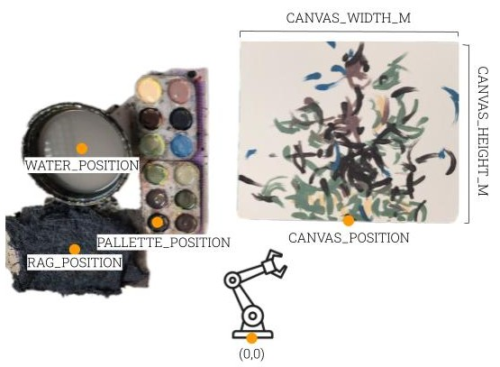

# Equipment

Here is a list of the equipment that we use and some links to purchase. Each item may be able to be swapped out with small changes to the code.

- [Palettes for paint](https://www.amazon.com/gp/product/B07DKWTXWT/ref=ppx_yo_dt_b_search_asin_title?ie=UTF8&psc=1)
- [8x10 inch canvas boards](https://www.amazon.com/gp/product/B07RNK7DJ7/ref=ppx_yo_dt_b_search_asin_title?ie=UTF8&psc=1)
- [11x14 inch canvas boards](https://www.amazon.com/gp/product/B087F4F5DK/ref=ppx_yo_dt_b_search_asin_title?ie=UTF8&psc=1)
- [Canon EOS Rebel T7i (With 18-55mm Lens and With Web Streaming Kit)](https://www.bhphotovideo.com/c/product/1714575-REG/canon_canon_eos_rebel_t7.html)
- [Camera Desk Mount Stand](https://www.amazon.com/gp/product/B08LV7GZVB/ref=ppx_yo_dt_b_search_asin_title?ie=UTF8&th=1)

# Monitoring Painting Progress

We use tensorboard to monitor the progress of the painting.

```
# In another terminal, run this to view progress
tensorboard --logdir Frida/src/painting_log

# Open browser and navigate to http://localhost:6006/
```

# Arguments

```
python3 paint.py
    [--simulate] Run in only simulation
    [--robot] Which robot to use [franka|xarm]
    [--xarm_ip] If using xarm, specify its IP address
    [--materials_json path] Where JSON file specifying location of painting materials is
    [--use_cache] Use cached calibration files. Necessary if --simulation
    [--cache_dir path] Where the cached calibration files are stored if using them
    [--ink] If using a marker or brush pen, use this so the robot knows it doesn't need paint
    [--render_height int] Height of the sim. canvases. Decrease for CUDA memory errors. Default 256
    [--num_papers int] Number of full sheets of paper to fill with training brush strokes (30 per paper)
    [--n_colors int] Number of discrete paint colors to use
    [--use_colors_from path] If specified, use K-means to get paint colors from this image. Default None
    [--num_strokes int] The desired number of strokes in the painting
    [--objective [one or many text|clip_conv_los|l2|sketch|style]]
    [--objective_data] See below
    [--objective_weight] See below
    [--num_augs int] Number of augmentations when using CLIP
    [--lr_multiplier float] How much to scale the learning rates for the brush stroke parameter optimization algorithm
    [--num_adaptations int] Number of times to pause robot execution to take a photo and replan
    [--init_optim_iter int] Optimization iterations for initial plan
    [--optim_iter int] Optimization iterations for each time FRIDA replans
    [--dont_retrain_stroke_model] If set, the stroke model will not be retrained during optimization and it will be taken from the cache_dir path
    [--painting_path path] Path to the painting file to use for initialization, it must be a .pkl file
```

If running with UV run

```
uv run paint.py [args]
```


# Objectives

Frida can paint with a number of different objectives that can be used singularly or in weighted combination. They are used to compare the simulated painting plan and a target datum (image or text):
- `l2` - Simple Euclidean distance is computed between the painting and target image
- `clip_conv_loss` - Compare the CLIP Convolutional features extracted from the painting and target image
- `clip_fc_loss` - Compare the CLIP embeddings of the painting and target image
- `text` - Compare the CLIP embeddings of the paiting and the input text description
- `style` - Compares style features from the painting and the target image
- `sketch` - [Use `clip_conv_loss` instead right now] Converts the painting and target sketch into sketches then compares them
- `emotion` - Guide the painting towards the following emotions: amusement, awe, contentment, excitement, anger, disgust, fear, sadness, something else. Specified in comma-sparated list of weights. e.g., half anger and fear: `--objective_data 0,0,0,0,.5,0,.5,0,0`

Each objective specified must have a specified data file and weight given to it. Objectives can be specified for the initial optimization pass and for the full, final optimization. Here is an example of how to specify objectives where we have an initial objetive to make the painting look like `style_img.jpg` and then a final objective to have the style of `style_img.jpg` with the text description `"a frog ballerina"`:
```
cd Frida/src
python3 paint.py --simulate --use_cache --cache_dir caches/sharpie_short_strokes
   --objective style text
   --objective_data path/to/style_img.jpg  "a frog ballerina"
   --objective_weight 0.2  1.0
```

## Setup for XArm5 (Ink Mode)

### XArm

1. Clamp the XArm securely to a stable surface.

    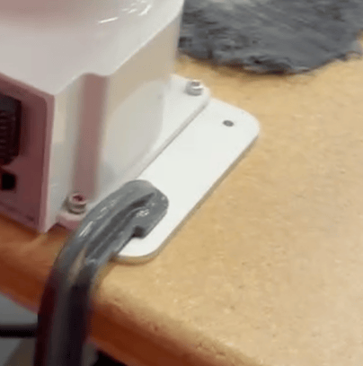

2. Connect the XArm to a power source.
    Ensure the voltage regulator matches your region's voltage output (e.g., 110V or 220V).

3. Connect the Ethernet cable from the XArm to your computer.

    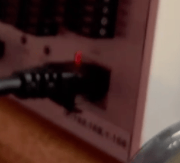

4. Note the IP Address of the XArm.

    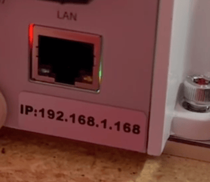

    In this example, the XArm's IP address is `192.168.1.168`.

5. Configure the network settings on your Linux computer:
    - Go to the network settings.
    - Set the IPv4 Method to `Manual`.
    - Use the following configuration:
      - **Netmask**: `255.255.255.0`
      - **Address**: `192.168.1.X` (where `X` is a number different from the robot's IP).
      - **Gateway**: `192.168.1.168`.

    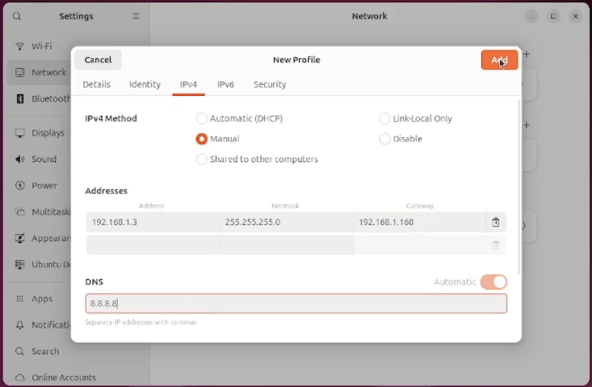

6. Turn off and on network

    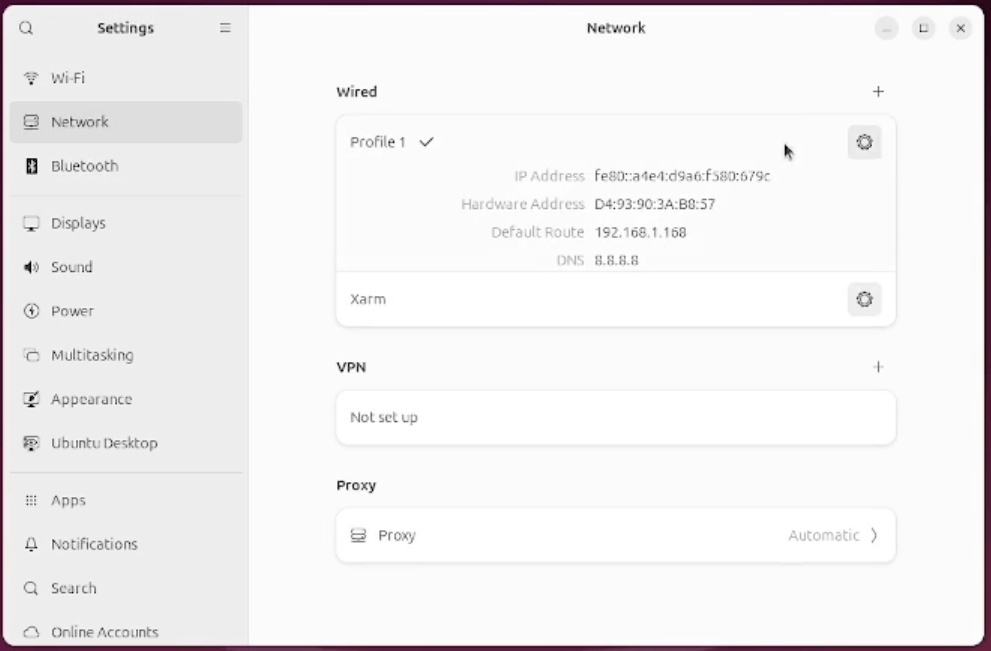

    This will ensure that the connection is reset.
7. Test the XArm connection by opening a browser and going to `http://192.168.1.168:18333`.
    By default, the Xarm uses port 18333 and the IP address must be the same as the Xarm’s address.

    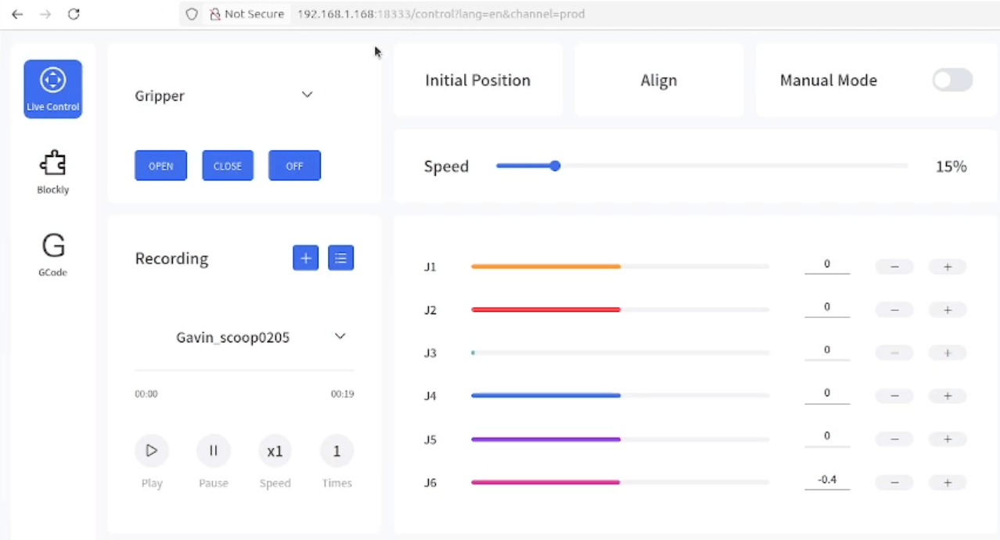

8. Mount Sharpie with corresponding mount

    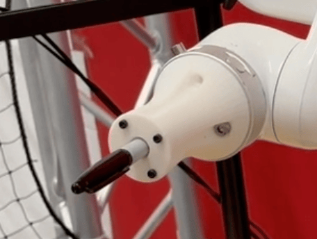

    We use a spring-loaded mount to hold the Sharpie.


### Camera

For the camera we are using a Canon DSLR.

1. Turn the camera on.
2. Change the camera setting to auto-focus.
3. Take pictures to focus.
4. Switch back to manual mode.
5. Connect the power cord.
6. Connect the data cord to the computer.


### Running Spline FRIDA

1. Clone FRIDA repository from GitHub

```bash
git clone -b spline-frida-z-master-resolved git@github.com:cmubig/Frida.git
```

Install environment as mentioned in Installation heading.

### Material Setup
In this step, the materials' coordinates are placed in the file `materials_xarm_paint.json`. Additionally, if we were using FRIDA with a brush, in this file we would set the pallets, water, and rag position. For more information check out Physical Setup heading.


For this case we will be using the following command:

```bash
python3 paint.py \
    --objective clip_conv_loss \
    --objective_data src/frida.jpg \
    --objective_weight 1.0 \
    --num_strokes 81 \
    --lr_multiplier 2.5 \
    --init_optim_iter 2000 \
    --num_adaptations 1 \
    --use_cache \
    --cache_dir caches/ink \
    --robot xarm \
    --ink \
    --xarm_ip 192.168.1.168 \
    --vae_path mocap/saved_models/general.pt \
    --materials_json ../materials_xarm_paint.json \
    --painting_path output/frida.pkl
```

- **`--objective`**: Specifies the objective for the painting. In this case, it uses `clip_conv_loss` to recreate the image.
- **`--objective_data`**: The target image that the painting will attempt to recreate.
- **`--objective_weight`**: Determines the weight of the objective. Since only one objective is set, it is set to `1.0`.
- **`--num_strokes`**: The number of strokes to be used in the painting.
- **`--lr_multiplier`**: The learning rate for parameters like stroke width and length. Typically set between `1` and `2.5`.
- **`--init_optim_iter`**: The number of optimization iterations. Higher values improve quality but increase runtime.
- **`--use_cache`**: Enables caching of calibration files to avoid redundant processing.
- **`--cache_dir`**: Specifies the directory (`caches/ink`) where calibration files are saved. Files can be manually erased to reset specific steps.
- **`--robot`**: Specifies the type of robotic arm being used.
- **`--ink`**: Indicates the use of a Sharpie, skipping paint-related steps.
- **`--xarm_ip`**: The IP address of the XArm robot.
- **`--vae_path`**: Defines the path to the autoencoder for trajectory generation.
- **`--materials_json`**: Specifies the file containing the coordinates of the materials.
- **`--painting_path`**: The path where the painting file will be saved.

Additional
- **`--dont_retrain_stroke_model`**: If a stroke model was already trained it would skip over this step


Alternatively we can run

```bash
uv run paint.py \
    --objective clip_conv_loss \
    --objective_data src/frida.jpg \
    --objective_weight 1.0 \
    --num_strokes 81 \
    --lr_multiplier 2.5 \
    --init_optim_iter 2000 \
    --num_adaptations 1 \
    --use_cache \
    --cache_dir caches/ink \
    --robot xarm \
    --ink \
    --xarm_ip 192.168.1.168 \
    --vae_path mocap/saved_models/general.pt \
    --materials_json ../materials_xarm_paint.json \
    --painting_path output/frida.pkl
```

Follow the instructions in the terminal

2. Brush Calibration

The first step is to calibrate the sharpie’s tip. Here with the keys “w” and “s” the arm will increase or decrease the gap between the sharpie and the canvas. The objective is to place the sharpies tip barely touching the canvas. Set the canvas so the tip of the sharpie should be in the center of it and fix it with tape at the sides. It will ask for two different heights but for the sharpie only one is needed.

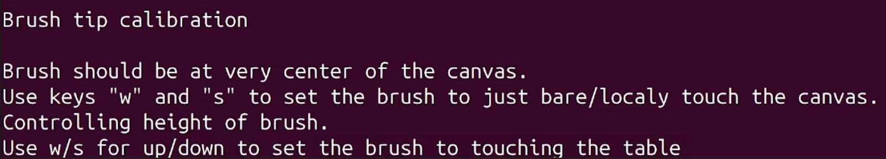

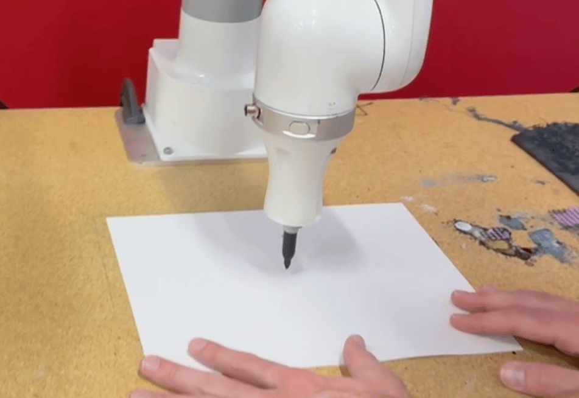

3. Canvas Homography

It will ask for the corners of the canvas. They must be selected clockwise starting with the top left corner

The output should look something like this

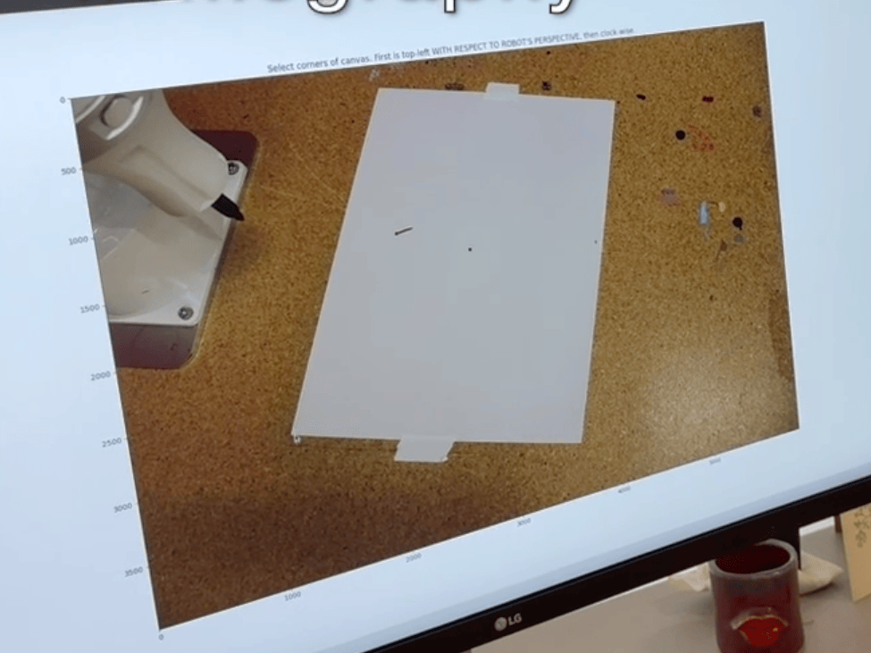

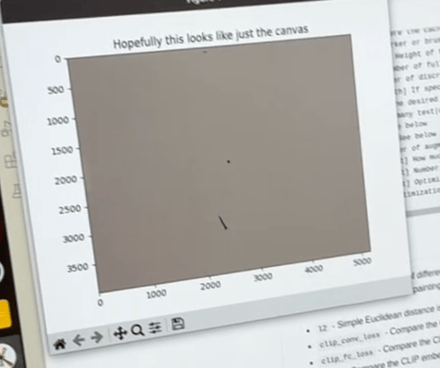

X Y Calibration

Set a new piece of canvas on top and tape it. Then continue, it will draw points evenly distributed. Optionally activate Tensorboard to verify each step, we can make sure that the points are being set where the arm thinks that they are being set. It should show yellow dots with an additional dot in the center.

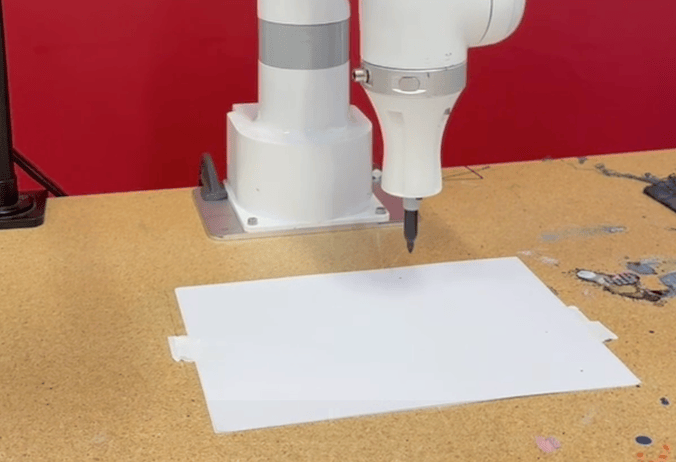

4. Stroke Library

A stroke library needs to be created. Place a new piece of paper, press Enter and the arm will start to draw lines. Once finished it can create more strokes by placing a new canvas or we can stop by pressing ctrl+c. And re-run the same command.

The strokes can also be verified in Tensorflow, there, the start placement of the sharpie will be visible with a red circle. This just ensures that the homography is still valid. Also, the stroke library optimization can be visible in the `IMAGES` tab.

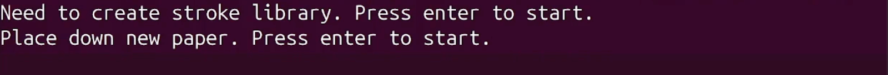

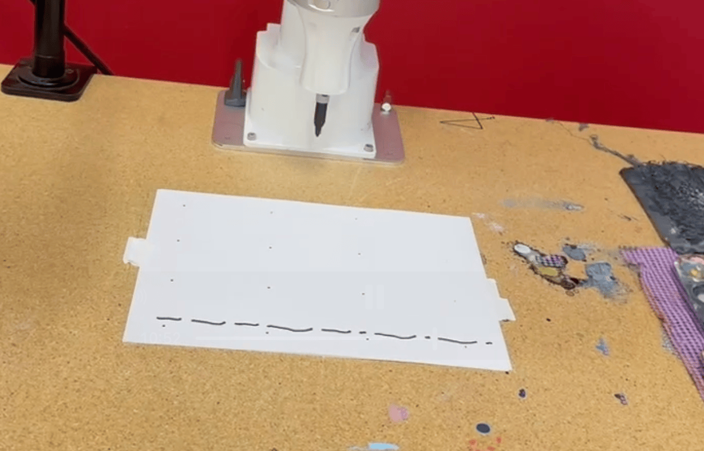

5. Stroke Optimization

Once the stroke simulation is finished the optimization for the target image with the stroke model will begin. As it optimizes we can see the process in Tensorflow. Once finished the arm will start to draw.

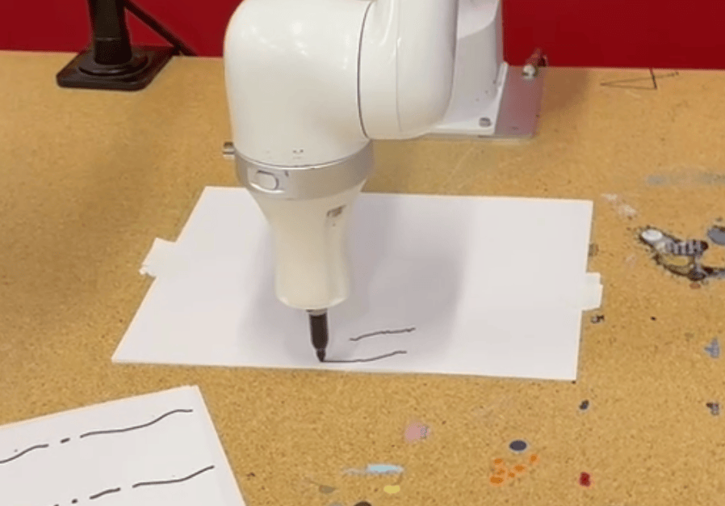

### Common Errors

- If the camera is accidentally bumped, the homography might no longer be valid and should be recalibrated.
- Ensure the camera remains powered on during the training and setup process. If it powers off, turn it back on.
- If a memory error occurs during stroke optimization due to insufficient GPU memory, reduce the number of strokes.
- Sometimes Camera is stuck with a terminal message as `Identifier 3` press the shuter button and FRIDA will continue process.


## Acknowledgements

Thank you to:
- Sunyu Wang for the brilliant, spring-loaded Sharpie holding end-effector
- [Jia Chen Xu](https://github.com/jxu12345) for writing FRIDA's perception code
- Heera Sekhr and Jesse Ding for their help in the early stages of designing FRIDA's planning algorithms
- [Vihaan Misra](https://github.com/convexalpha) for writing a sketch and audio loss functions.
- Tanmay Shankar for his help with initial installation and fixing the Sawyer robot
- Kevin Zhang for his incredible help with installation with Franka robot
